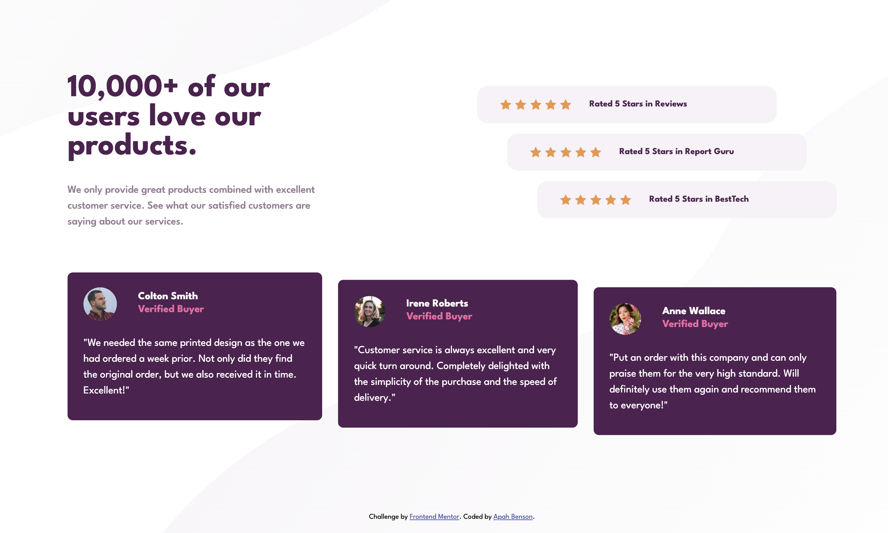

# Frontend Mentor - Social proof section solution

This is a solution to the [Social proof section challenge on Frontend Mentor](https://www.frontendmentor.io/challenges/social-proof-section-6e0qTv_bA). Frontend Mentor challenges help you improve your coding skills by building realistic projects.

## Table of contents

- [Overview](#overview)
  - [The challenge](#the-challenge)
  - [Screenshot](#screenshot)
  - [Links](#links)
- [My process](#my-process)
  - [Built with](#built-with)
  - [What I learned](#what-i-learned)
- [Author](#author)

**Note: Delete this note and update the table of contents based on what sections you keep.**

## Overview

### The challenge

Users should be able to:

- View the optimal layout for the section depending on their device's screen size

### Screenshot



### Links

- Solution URL: [Github](https://github.com/apah-dev/social-proof-section-master.git)
- Live Site URL: [Live Site](https://apah-dev.github.io/social-proof-section-master/)

### Built with

- Semantic HTML5 markup
- Flexbox
- CSS Grid
- Mobile-first workflow

### What I learned

Learn the to use transform
And to set the background image position using vw and vh
Also learnt that the exact syntax for targeting a div class must be used within the media querie too to enable padding change

To see how you can add code snippets, see below:

```css
body {
  background-image: url(images/bg-pattern-top-desktop.svg),
    url(images/bg-pattern-bottom-desktop.svg);
  background-position: right 40vw bottom 19vh, left 15vw top 5vh;

  /* Here's the two div class edits and how it finally worked 
must likely about the specificity in css */

  .ratings-section .ratings {
    background-color: var(--LightGrayishMagenta);
    padding: 1rem 2rem;
    border-radius: 1rem;
    color: var(--VeryDarkMagenta);
    font-weight: 700;
    font-size: 0.85rem;
    margin-bottom: 1rem;
  }
  .ratings .stars {
    display: flex;
    justify-content: center;
    gap: 0.35rem;
    margin-left: 1rem;
  }
}

.comments:nth-of-type(2) {
  /* margin-top: 3rem; */
  transform: translate(0%, 5%);
}
```

## Author

- Frontend Mentor - [@apah-dev](https://www.frontendmentor.io/profile/apah-dev)
- Twitter - [@benson_apah](https://www.twitter.com/benson_apah)
